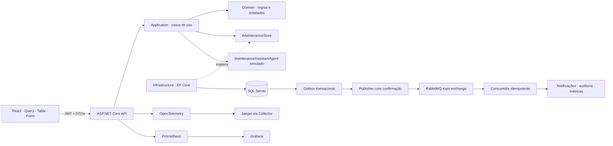
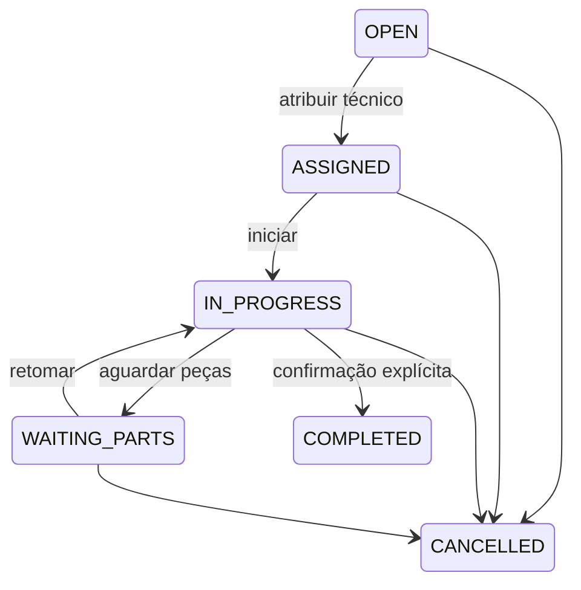
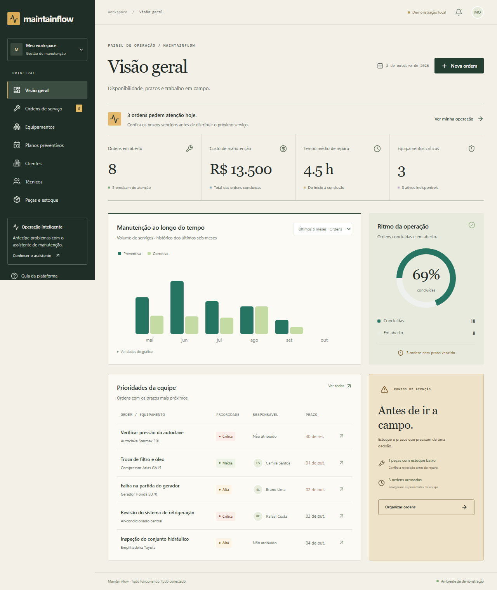
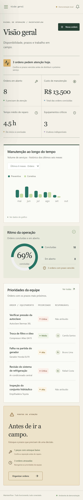

# MaintainFlow

Plataforma full stack para gestão de manutenção preventiva e corretiva. Centraliza ativos, clientes, técnicos, ordens, peças e indicadores para reduzir indisponibilidade, atrasos e custos sem rastreabilidade.

## Executar

Requisitos: Docker Desktop com contêineres Linux, pelo menos 6 GB de memória disponíveis e portas 8080, 5000, 1433, 5672, 15672, 3000, 9090 e 16686 livres.

```powershell
./tools/setup.ps1
docker compose up -d --build
```

Linux/macOS: `sh tools/setup.sh` e o mesmo comando Compose. A inicialização gera `.env` com senhas únicas, aplica as migrações e insere dados fictícios uma única vez. Nunca publique `.env`.

Abra [MaintainFlow](http://localhost:8080). Login: `admin@maintainflow.local` ou `tecnico@maintainflow.local`; senha: valor de `DEMO_PASSWORD` em `.env`. O técnico de demonstração corresponde a Rafael Costa e pode alterar somente as ordens atribuídas a ele.

| Serviço | Acesso |
|---|---|
| Interface | http://localhost:8080 |
| Swagger com Bearer JWT | http://localhost:5000/swagger |
| API / saúde | http://localhost:5000/health/ready |
| RabbitMQ Management | http://localhost:15672 — usuário `maintainflow`, `RABBIT_PASSWORD` |
| Grafana | http://localhost:3000 — usuário `admin`, `GRAFANA_PASSWORD` |
| Prometheus | http://localhost:9090 |
| Jaeger | http://localhost:16686 |

`docker compose down` encerra o ambiente preservando volumes. `docker compose logs -f api` mostra logs estruturados. Para desenvolvimento no Windows, use `docker compose up -d sqlserver rabbitmq otel-collector jaeger` e `./tools/run-api.ps1`; o script lê `.env` e usa o SDK instalado no projeto, quando presente. Em outros ambientes, configure as mesmas variáveis em `backend/Api` e use `dotnet run --project backend/Api --urls http://localhost:5000`.

### Explorar sem Docker

```sh
cd frontend
npm ci
npm run dev
```

Abra http://localhost:5184 e clique **Explorar demonstração**. Esse modo usa exclusivamente `localStorage`, com indicador visível de demonstração. Não faz fallback silencioso quando a API falha. Os dados da demonstração são independentes do SQL Server; podem ser reiniciados removendo a chave `maintainflow.demo.v1` do armazenamento do navegador. O tempo médio de reparo nesse modo é simulado; na API é calculado pelos horários reais.

## Arquitetura



As dependências do domínio e dos casos de uso apontam para dentro. `Domain` não depende de frameworks. `Application` possui contratos, permissões, agente e `OrderService`; depende da porta `IMaintenanceStore`, sem EF Core ou RabbitMQ. `Infrastructure` implementa armazenamento, projeções de DTOs, migrações, seed e workers. `Api` é a composição e a fronteira HTTP: JWT, políticas, validação de contratos, erros, paginação, OpenAPI e consultas de catálogo. `Tests` exercita regras e integração.

```text
backend/
  Domain/          Entidades, estados, criticidade e regras de estoque
  Application/     DTOs, casos de uso, agente e porta de armazenamento
  Infrastructure/  SQL Server, EF Core, migrações, seed e mensageria
  Api/             Endpoints, autenticação, políticas e observabilidade
  Tests/           xUnit, Moq e Testcontainers
frontend/          React 19, TypeScript, Vite, Tailwind CSS v4
ops/               Telemetria, Grafana, Prometheus e Kubernetes
```

As respostas HTTP usam DTOs ou projeções explícitas; nenhuma entidade EF é retornada. Os catálogos e as ordens têm paginação limitada a 100 itens, com filtros e contagem total. Versões de ordem e estoque são protegidas por `rowversion`; conflitos retornam HTTP 409. Escritas de domínio, auditoria e outbox são salvas na mesma transação de `SaveChanges`.

## Fluxos de negócio

- Cadastre clientes, equipamentos, técnicos, peças e planos. Peças novas começam com saldo zero; registre entradas separadamente.
- Abra chamados corretivos e atribua técnicos ativos. Mudanças do Kanban são persistidas com atualização otimista e rollback em erro. As ações também estão disponíveis no drawer, sem depender do arraste.
- A passagem para `ASSIGNED` exige técnico. A passagem para `COMPLETED` exige confirmação digitada ou assinatura. Ordens finalizadas não podem ser reabertas.
- Registre consumo de peças somente em ordens `IN_PROGRESS` ou `WAITING_PARTS`. Estoque e custo mudam juntos; saldo negativo é rejeitado.
- Planos podem vencer por data, periodicidade, quilometragem ou horas. O worker verifica a cada minuto e gera preventivas vencidas. O botão **Gerar OS** permite iniciar o mesmo caso de uso. Uma transação serializável impede duas preventivas abertas para o mesmo plano.
- Ao concluir, grave o histórico e recalcule disponibilidade considerando outras ordens abertas do ativo.
- O dashboard calcula ordens, custos concluídos, reparo médio, criticidade, atrasos, estoque baixo e séries mensais. Custos de ordens em execução aparecem nos detalhes e entram no dashboard após a conclusão.



## RabbitMQ

Exchange durável `maintainflow.events`, tipo `topic`, com fila durável `maintainflow.operations`. Eventos: `work-order.created`, `maintenance.overdue`, `part.low-stock`, `equipment.unavailable` e `work-order.completed`. Eventos de atraso são emitidos quando um plano vencido gera uma preventiva.

O publisher publica mensagens persistentes com `MessageId` da outbox e usa publisher confirms antes de marcar `PublishedAt`. Se RabbitMQ falhar, os eventos permanecem no SQL Server e serão reenviados. A entrega é **pelo menos uma vez**, portanto pode haver duplicatas após falhas. O consumidor deduplica pelo índice único `Notification.EventId`; só confirma a mensagem depois de persistir notificação e auditoria. Mensagens JSON malformadas vão para `maintainflow.dead`; falhas transitórias são reenfileiradas. A fila de operações realiza os quatro efeitos: notificações, auditoria, alertas de baixo estoque e atualização de contadores operacionais.

O worker atual é intencionalmente único: mantenha uma réplica com workers ativos. Separar workers e reivindicar mensagens da outbox com lease é necessário antes de escalar horizontalmente os publishers.

## Assistente de manutenção

`MaintenanceAssistantAgent` é determinístico e simulado, substituível pela interface `IMaintenanceAssistantAgent`. Não usa serviços externos nem faz diagnóstico clínico. Ferramentas disponíveis em `IAssistantTools`:

| Ferramenta | Efeito |
|---|---|
| `getEquipmentHistory(equipmentId)` | Leitura do histórico |
| `getOpenWorkOrders(equipmentId)` | Leitura das ordens abertas |
| `getMaintenancePlan(equipmentId)` | Leitura do checklist dos planos |
| `checkPartAvailability(partId)` | Leitura do saldo da peça |
| `createReviewRequest(workOrderId, reason)` | Registra pedido de revisão; exige ação humana na interface |

O JSON contém `severity`, `probableCauses`, `recommendedChecklist`, `suggestedParts`, `estimatedDowntime`, `requiresTechnicianApproval` e `explanation`. Cada recomendação identifica `histórico`, `plano` ou `regras`. O agente não adivinha peças a substituir, portanto `suggestedParts` permanece vazio no mock.

O técnico deve clicar **Aceitar e criar checklist**, **Alterar** ou **Recusar**. A decisão e as notas são auditadas; a revisão exige motivo e botão explícito. O agente não recebe ferramentas para concluir ordens, alterar estoque, criar custos ou atualizar equipamentos. A assinatura Bencho é uma confirmação operacional, com alternativa digitada, sem certificação digital.

## API

JWT de duas horas, assinatura HS256 e validação de emissor/audiência. `Manager` administra cadastros, atribuições, estoque e prioridades. `Technician` lê os dados da operação e altera somente suas ordens. Login possui limitação por IP. As identidades de demonstração só funcionam com `Auth__DemoEnabled=true` e senha configurada.

| Método | Rota |
|---|---|
| POST | `/auth/login` |
| GET, POST, GET `{id}`, PUT `{id}`, DELETE `{id}` | `/customers`, `/equipment`, `/technicians`, `/parts`, `/maintenance-plans` |
| POST, GET | `/work-orders` |
| GET | `/work-orders/{id}` |
| PATCH | `/work-orders/{id}/status`, `/work-orders/{id}/priority` |
| POST | `/work-orders/{id}/assign`, `/work-orders/{id}/agent-suggestion`, `/work-orders/{id}/review-requests` |
| POST | `/agent-suggestions/{id}/decision` |
| POST | `/maintenance-plans/{id}/generate`, `/parts/{id}/movements` |
| GET | `/dashboard/metrics`, `/equipment/{id}/history`, `/notifications`, `/audit` |

Ordens aceitam `page`, `pageSize`, `search`, `customerId`, `status`, `technicianId`, `criticality`, `from` e `to`; `criticality` representa a criticidade do equipamento, independente da prioridade operacional da ordem. A atualização de status envia a versão retornada pela leitura:

```json
{"status":"IN_PROGRESS","version":"BASE64_ROWVERSION"}
```

Erros retornam `application/problem+json`, com `title`, `status` e `traceId`. Violações de negócio retornam 400; acesso negado, 403; ausência, 404; concorrência ou vínculo de exclusão, 409. As migrações estão versionadas em `backend/Infrastructure/Migrations`.

## Interface e acessibilidade

React, TypeScript, Vite, Tailwind v4, shadcn/ui, TanStack Query/Table, React Hook Form/Zod, DnD Kit, Motion e Vaul. Bklit renderiza o gráfico; MicroKit oferece controles de conclusão e prioridade; Kokonut aparece somente no onboarding; Bencho fornece a adaptação da assinatura. Veja [atribuições e licenças](THIRD_PARTY_NOTICES.md).

Drawers possuem título/descrição, foco gerenciado e fechamento por Escape. Formulários expõem erros e `aria-invalid`. Motion respeita movimento reduzido. O gráfico inclui tabela de dados; ações no drawer oferecem alternativa ao Kanban. Filtros por cliente, técnico, prioridade, status e intervalo convivem com paginação no servidor.

## Observabilidade

OpenTelemetry exporta traces HTTP para o Collector e Jaeger; métricas HTTP e do meter `MaintainFlow` ficam em `/metrics`. Prometheus coleta a cada 15 segundos. Grafana provisiona as fontes e um dashboard de requisições, p95 e eventos publicados/consumidos. Serilog gera logs JSON no stdout com contexto de requisição; consulte `docker compose logs api` e correlacione o `traceId` retornado em falhas.

O dashboard de negócio da interface é calculado a partir do SQL Server; os contadores Prometheus de eventos medem a atividade do processo e podem reiniciar quando o processo reinicia. Grafana não recebe os logs nesta versão; para busca centralizada de logs, acrescente Loki/um coletor de stdout. Proteja `/metrics` por rede interna em produção.

## Testes e CI

```sh
dotnet test backend/Tests
cd frontend
npm test
npm run build
npx playwright install chromium
npm run test:e2e
```

Integração real exige Docker: no PowerShell, `$env:RUN_INTEGRATION='1'; dotnet test backend/Tests`; em Linux, `RUN_INTEGRATION=1 dotnet test backend/Tests`. Sem essa variável, o teste fica explicitamente ignorado. Testcontainers cria SQL Server e RabbitMQ isolados e os remove ao finalizar.

xUnit cobre transições, confirmação, técnico obrigatório, estoque, medidores, criticidade e permissões. Moq verifica a resposta estruturada do agente. A integração faz login, cria uma ordem, verifica evento RabbitMQ/outbox/auditoria, altera status e rejeita versão obsoleta. Vitest exercita falhas e validação do formulário. Playwright verifica desktop/mobile, drawers, formulários com axe e rollback visual do Kanban após HTTP 409. A CI em `.github/workflows/ci.yml` compila, executa integração em Docker e testes de interface, e constrói imagens sem publicá-las.

Consulte [VALIDATION.md](docs/VALIDATION.md) para os resultados efetivamente obtidos neste ambiente; não confunda testes disponíveis com testes executados.

## Dados e screenshots

O seed inclui três clientes, três técnicos, oito equipamentos, oito ordens ativas, oito manutenções anteriores, planos e três peças. As datas são relativas à inicialização. A demonstração local contém histórico adicional para explorar as séries mensais.





Os testes de navegador geram essas capturas a partir do próprio projeto. Para atualizar, execute `npm run test:e2e` no front-end.

## Kubernetes — etapa avançada

Os manifests em `ops/k8s` destinam-se a um cluster de desenvolvimento Linux com provisionador de volumes e capacidade para SQL Server. Para kind, construa e carregue as imagens:

```sh
docker build -t maintainflow-api:latest -f backend/Dockerfile .
docker build -t maintainflow-web:latest -f frontend/Dockerfile .
kind load docker-image maintainflow-api:latest maintainflow-web:latest
kubectl apply -f ops/k8s/namespace.yaml
```

Copie `ops/k8s/api.env.example` para `ops/k8s/api.env`, substitua os valores e crie os Secrets. As senhas devem coincidir na conexão da API e nos serviços:

```sh
kubectl -n maintainflow create secret generic maintainflow-data --from-literal=sql-password='SUA_SENHA_SQL' --from-literal=rabbit-password='SUA_SENHA_RABBIT'
kubectl -n maintainflow create secret generic maintainflow-api --from-env-file=ops/k8s/api.env
kubectl apply -k ops/k8s
kubectl -n maintainflow rollout status deployment/api
kubectl -n maintainflow port-forward service/web 8080:8080
```

O proxy usa o Service `api`. Readiness verifica o banco; startup probe tolera a inicialização. SQL Server e RabbitMQ usam StatefulSets/PVCs. O stack de telemetria pode permanecer no Compose ou ser instalado no cluster, ajustando o endpoint do Collector e a coleta Prometheus. Manifests não foram apresentados como implantação produtiva: antes de produção, configure identidade/IdP, TLS/Ingress, usuário SQL com privilégio mínimo, backups/restauração, secrets externos, políticas de rede, retenção de auditoria e jobs de migração. Desabilite as identidades demo e Swagger; separe os workers antes de aumentar réplicas.


